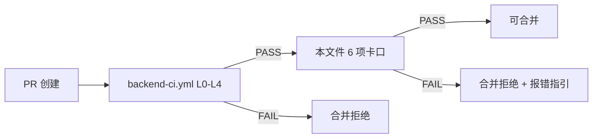

# ⚠️ DEPRECATED（2026-07-19 架构师标记）

> **本文件已不再生效**。原因：本文件是 markdown 文档（不是真 GitHub Actions workflow），GitHub 永远不会执行其中的 YAML 块。
>
> **替换方案**：见 `.github/workflows/pr-gate-ci.yml`（**真 workflow**，由本文件 §二/§五/§六/§七/§九/§十一 提取）。
>
> **保留原因**：审计追溯 + 历史决策可查。
>
> **维护状态**：冻结，不再修改。如发现本文件与 pr-gate-ci.yml 有冲突，以 pr-gate-ci.yml 为准。
>
> ---
>
> **触发本替换的来源**：`harness/checklist.md` W4 P4 §5.1.1。

---

# PR Gate — CI 守门 Workflow
|
|> **真源**：本文件是 `.cursor/skills/pr-gate/SKILL.md` 的**强约束实现**。
|> **逻辑**：所有 PR / push 合入 `main` / `develop` 都必须经本文件 6 项卡口。
|> **pre-commit hook** (`backend/scripts/check_14.sh`) 做**提交前**本地拦截，本文件做**PR 阶段** CI 强制拦截。
|> 与 `backend-ci.yml`（L0-L4 跑分）**串联**：必须先 L0-L4 PASS，再过本文件 6 项。
|>
|> **Gate 3/4 状态**：TODO。ATDD 目录和 ADR freeze 约定尚未建立，Gate 3/4 暂时注释，待 W4 Phase 2/3 建立后启用。
|

---

## 一、触发条件

```yaml
on:
  pull_request:
    branches: [main, develop]
  push:
    branches: [main, develop]
```

---

## 二、6 项硬约束卡口

### 卡口 1：Commit 格式（commitlint）

```yaml
- name: Conventional Commits
  uses: wagoid/commitlint-github-action@v5
  with:
    configFile: .commitlintrc.json
```

`.commitlintrc.json`：

```json
{
  "extends": ["@commitlint/config-conventional"],
  "rules": {
    "type-enum": [2, "always", ["feat", "fix", "refactor", "test", "docs", "chore", "perf"]],
    "header-max-length": [2, "always", 60],
    "subject-case": [2, "always", "lower-case"]
  }
}
```

**失败后果**：CI red，PR 阻塞。**不豁免**。

---

### 卡口 2：FR 编号关联

```yaml
- name: FR 编号关联检查
  run: |
    if ! grep -E "^FR-[A-Z]+-[0-9]+" "$PR_TITLE $PR_BODY" ; then
      echo "::error::PR 必须含 FR 编号（格式: FR-<MODULE>-<NUM>，例：FR-PLAN-01）"
      exit 1
    fi
```

**豁免**（仅 W4 一段）：
- `chore(deps): ...`
- `docs(readme): ...`
- `ci(workflow): ...`

需在 commit message body 加 `BREAKING-CHANGE-FR-EXEMPT: <reason>` 才会放过。

---

### 卡口 3：验收测试存在性（atdd 文件）

> **TODO**：ATDD 目录尚未建立，暂不启用。待 W4 Phase 2 建立 `harness/atdd/` 后启用。

```yaml
# - name: 验收测试存在性
#   run: |
#     bash .github/scripts/check_atdd.sh
```

---

### 卡口 4：ADR 冲突检查

> **TODO**：ADR freeze 约定尚未建立，暂不启用。待 W4 Phase 3 建立 freeze 字段清单后启用。

```yaml
# - name: ADR 冲突检查
#   run: |
#     bash .github/scripts/check_adr.sh
```

---

### 卡口 5：覆盖率（硬卡数字，不"可能不达标"）

```yaml
- name: 覆盖率硬卡
  run: |
    cd backend
    uv run pytest tests/ \
      --cov=app \
      --cov-report=xml \
      --cov-fail-under=60
```

**严格按** `coding-standards.mdc` §十八（测试规范）阈值：

| 模块 | 阈值 | 命令 |
|------|------|------|
| `rules/` | ≥ 90% | `pytest tests/unit -k rules --cov-fail-under=90` |
| `agents/` `middleware/` | ≥ 80% | 同上 |
| `tools/` | ≥ 70% | 同上 |
| 整体 | ≥ 60% | 上方主命令 |

**注**：模块级 `--cov-fail-under` 是 W4 接入改造点——首次接入仅跑整体 ≥ 60%。

---

### 卡口 6：PR Diff 大小

```yaml
- name: PR Diff 大小
  uses: rhysd/actionlint@v1
  with:
    script: |
      #!/usr/bin/env bash
      LINES=$(git diff --shortstat origin/${{ github.base_ref }}...HEAD | awk '{print $4 + $6}')
      if [ "$LINES" -gt 600 ]; then  # 严于 pr-gate skill 的 300 行（CI 卡 2 倍）
        echo "::error::PR diff = $LINES 行，超过 600 行上限"
        echo "请拆分为多个小 PR（推荐每个 PR 关联 1 个 FR）"
        exit 1
      fi
```

**说明**：CI 给 600 行的硬上限（比 skill 文档给的 300 翻倍），为开发者留 buffer。

---

## 六、与 backend-ci.yml 的串联



`backend-ci.yml` 跑 L0-L4 + Golden Set，本文件跑 6 项业务守门。**两者必须都 PASS** 才能合入。

---

## 七、失败案例输出格式

每个卡口失败后，PR 会自动评论：

```
❌ PR Gate 失败

| # | 卡口 | 状态 | 修复指引 |
|---|------|------|----------|
| 1 | Commit 格式 | ✅ | — |
| 2 | FR 关联 | ⚠️ TODO | 在 PR body 加 `FR-XXX-XX` |
| 3 | 验收测试 | ⚠️ TODO | ATDD 目录建立后启用 |
| 4 | ADR 冲突 | ⚠️ TODO | ADR freeze 约定建立后启用 |
| 5 | 覆盖率 | ⚠️ TODO | 当前 58%，需 ≥ 60%，补 tests/unit/ |
| 6 | PR 大小 | ✅ | — |

📖 详情见：[`.cursor/skills/pr-gate/SKILL.md`](../.cursor/skills/pr-gate/SKILL.md)
```

---

## 八、示例（未来好的 PR vs 坏的 PR）

### ✅ 通过

```
标题: feat(plan): 实现计划回退按钮
body:
FR-PLAN-04（用户要求添加"撤回已发送计划"功能）

## 改动
- frontend/onboarding: 添加撤回按钮 UI
- api: 新增 POST /api/v1/plan/recall

## 验证
- ATDD/ATDD-PLAN-04.md 已新建
- backend/tests/unit/test_plan_04.py 已新增 5 个 case
- 覆盖率 65% ≥ 60%
```

### ❌ 被拒

```
标题: Update stuff
body:
随便改改
```

理由：标题无 type(scope)，body 无 FR-XXX-XX。

---

## 九、与 backend-ci.yml 的边界（防重复）

| 检查项 | 归属 |
|--------|------|
| ruff / mypy / pytest | `backend-ci.yml` |
| Golden Set --mode pr | `backend-ci.yml`（仅当 `prompts/*.md` 改动时触发，详见 W4 接入） |
| OpenAPI lint | `backend-ci.yml` |
| ack-pool 合规 | `backend-ci.yml` |
| **本文件 7 项**（含卡口 7） | 本 workflow |

不重复不遗漏：若某项在两边都跑会浪费 CI 分钟，**请删除其在本文件中的重复**。

---

### 卡口 7：L0-L6 文档一致性（2026-07-19 启用）

> **真源**：`.cursor/rules/l0-l6-gates.mdc`（L0-L6 唯一真源 + alwaysApply）。
>
> **背景**：2026-07-19 W4 P3 §4.5.12 把 GATES.md 从 `.cursor/skills/coding-standards/` 迁到 `.cursor/rules/l0-l6-gates.mdc`（真源从 skill 升级为 alwaysApply rule）。
>
> **背景**：2026-07-19 审计发现项目内 5 套 L0-L6 互相冲突的表格（详见 `harness/L0-L6-AUDIT-2026-07-19.md`）。修复后建立卡口 7 自动拦截后续漂移。

```yaml
- name: L0-L6 文档一致性扫描
  run: |
    set -e
    GATES=".cursor/rules/l0-l6-gates.mdc"
    FAIL=0
    echo "🔍 扫描非真源文档是否重写 L0-L6 表格..."

    # 白名单（真源 + 引用方）
    WHITELIST=(
      ".cursor/rules/l0-l6-gates.mdc"
      "harness/L0-L6-TRUTH.md"
      "harness/L0-L6-AUDIT-2026-07-19.md"
      "harness/checklist.md"
      ".github/workflows/pr-gate.yml"
      ".github/workflows/backend-ci.yml"
    )

    # 1) 检查非白名单文档是否重写完整 L0-L6 表格
    for f in $(git diff --name-only origin/main...HEAD); do
      # 跳过白名单
      skip=0
      for w in "${WHITELIST[@]}"; do
        if [ "$f" = "$w" ]; then skip=1; break; fi
      done
      [ $skip -eq 1 ] && continue

      # 只扫 .md 文件
      case "$f" in
        *.md) ;;
        *) continue ;;
      esac

      # 检测：如果文件含 6 行连续 "L[0-6] |" 表格行，视为重写完整表格
      if grep -E '^\| L[0-6] \|' "$f" | wc -l | grep -qE '^[6-9]$|^[1-9][0-9]+$'; then
        echo "::error::$f 重写了 L0-L6 完整表格（≥6 行 L[0-6] |）"
        echo "::error::修复方式：删除表格，改为 '详见 .cursor/rules/l0-l6-gates.mdc'"
        FAIL=1
      fi

      # 2) 检查过期阈值（≥ 80% 整体覆盖率）
      if grep -E 'coverage.*>=.*80%|覆盖率.*>=.*80%|≥ 80%.*覆盖率|≥ 80%.*coverage' "$f" >/dev/null 2>&1; then
        echo "::error::$f 包含过期的 'coverage ≥ 80%' 阈值（CI 硬卡 ≥ 60%）"
        FAIL=1
      fi
      # 3) 检查 L2 = Eval Runner 错位
      if grep -E '^\| L2 \|.*Eval Runner|Eval Runner.*L2' "$f" >/dev/null 2>&1; then
        echo "::error::$f 把 Eval Runner 写在 L2（历史错位，2026-07-19 已修复）"
        echo "::error::修复方式：Eval Runner 是 R-4 红线（详见 GATES.md §三），不是 L2"
        FAIL=1
      fi
    done

    if [ $FAIL -eq 1 ]; then
      echo "::error::L0-L6 一致性扫描失败，详见 harness/L0-L6-AUDIT-2026-07-19.md"
      exit 1
    fi
    echo "✅ L0-L6 文档一致性扫描 PASS"
```

**触发**：所有 PR 修改 `.md` 文件时自动跑。

**失败指引**：错误信息会指向具体文件和修复方式（详见 `harness/L0-L6-AUDIT-2026-07-19.md`）。

**白名单**（重写 L0-L6 表格是被允许的）：
- `.cursor/rules/l0-l6-gates.mdc`（**唯一真源 + alwaysApply**）
- `harness/L0-L6-TRUTH.md`（摘要）
- `harness/L0-L6-AUDIT-2026-07-19.md`（审计报告）
- `harness/checklist.md`（修复 checklist）
- `.github/workflows/pr-gate.yml`（本文件，含卡口 7 注释）
- `.github/workflows/backend-ci.yml`（CI 含 L0-L4 步骤注释）

---

## 十、参考

- `.cursor/skills/pr-gate/SKILL.md`
- `.cursor/rules/project-prohibitions.mdc` R-3 / R-4（5 条红线的真源）
- `backend-ci.yml`（L0-L4 跑分）
- `harness/MIGRATION-V2.md`（V2 取代 V1.6 整体路线图）
