# Harness 架构与使用指南

> **更新时间**：2026-07-19
> **适用范围**：SelfwellAgent V2 Harness（16 phase）
> **阅读路径**：第一次看按顺序读第一章到第五章；之后查问题翻第六章速查表

---

## 第一章：一句话理解 Harness

**Harness 是一条强制 AI 写代码时按固定步骤走完的流水线。**

你给一个功能需求（"我要做 XX"），Harness 强制 AI 走完 16 个 phase，每步有人负责、有证据文件、下一步只看上一步的证据。

```
PRD → 架构 → 评审 → 验收 → 计划 → 编码 → 验证 → 安全 → 部署 → 回归 → 签字
  → 故障响应 → 运营 → 经验沉淀 → 追问 → 数据回流（回到 PRD）
```

**核心价值**：避免 AI 一次性写完一堆代码不可控；通过"角色分工 + 证据链 + 状态机"让 AI 行为可审计、可中断、可回放。

---

## 第二章：架构全景（一张图）

```
┌─────────────────────────────────────────────────────────────────────┐
│                          主会话（你 + AI）                            │
│  "进入 Harness" / "按 Harness 跑 FR-XXX"                              │
└─────────────────────────────────────────────────────────────────────┘
                                  │
                                  ▼
┌─────────────────────────────────────────────────────────────────────┐
│  Skill: harness-dispatcher  ← 路由器（每轮消息首句调它）              │
│  • 读 state.json + workflow-v2.yaml                                  │
│  • 返回 next_agent 指令（不写代码、不读 evidence）                    │
└─────────────────────────────────────────────────────────────────────┘
                                  │
        ┌─────────────────────────┼─────────────────────────┐
        ▼                         ▼                         ▼
┌──────────────┐         ┌──────────────┐          ┌──────────────┐
│ 5 Reviewers  │         │ 5 Executors  │          │ Orchestrator │
│ 评审员       │         │ 执行员       │          │ 合成员       │
│              │         │              │          │              │
│ • 业务       │         │ • plan-gen   │          │ 仅在         │
│ • 技术       │         │ • developer  │          │ PRE_MORTEM + │
│ • 质量       │         │ • verifier   │          │ SIGN_OFF 两  │
│ • 安全*      │         │ • deployer   │          │ 阶段触发     │
│ • 部署*      │         │ • tester     │          │              │
│              │         │              │          │              │
│ 写 evidence  │         │ 写代码 +     │          │ 写 synthesis │
│ 不写代码     │         │ evidence     │          │ 不写代码     │
└──────────────┘         └──────────────┘          └──────────────┘
        │                         │                         │
        └─────────────────────────┼─────────────────────────┘
                                  ▼
                    ┌──────────────────────────┐
                    │  harness/evidence/  │
                    │  证据文件（每 phase 一份）│
                    │  + state.json（进度条）  │
                    └──────────────────────────┘
```

---

## 第三章：16 phase 状态机（V2 全量）

```mermaid
flowchart LR
  P1[1 PRD<br/>requirement-analyst]
  P2[2 ARCH_DESIGN<br/>tech-architect]
  P3[3 PRE_MORTEM<br/>5 reviewer + orchestrator]
  P4[4 ATDD<br/>quality-guardian]
  P5[5 PLAN<br/>plan-generator]
  P6[6 CODE<br/>developer]
  P7[7 VERIFY<br/>verifier]
  P8[8 SECURITY_TEST<br/>security-reviewer]
  P9[9 DEPLOY<br/>deployer]
  P10[10 REGRESSION<br/>tester]
  P11[11 SIGN_OFF<br/>orchestrator]
  P12[12 DATA_REPLAY<br/>requirement-analyst]
  P13[13 INCIDENT_RESPONSE<br/>deployer]
  P14[14 OPS_LOOP<br/>tester]
  P15[15 SKILL_UPDATE<br/>quality-guardian]
  P16[16 INTERRUPT_REVIEW<br/>quality-guardian]

  P1 --> P2 --> P3 --> P4 --> P5 --> P6 --> P7 --> P8 --> P9 --> P10 --> P11
  P11 --> P12
  P12 --> P1
  P11 --> P13 --> P14 --> P15 --> P16

  style P3 fill:#fff3e0
  style P8 fill:#ffecb3
  style P11 fill:#fff3e0
  style P16 fill:#f3e5f5
```



### 3.1 每 phase 速查

| # | phase | entry_agent | evidence 文件 | 完成标准（exit_criteria） |
|---|-------|-------------|---------------|---------------------------|
| 1 | PRD | requirement-analyst | `01-requirement.md` | 文件存在 + `signed: true` + `fr_refs` 含 FR 编号 |
| 2 | ARCH_DESIGN | tech-architect | `02-tech-design.md` | 文件存在 + `signed: true` + `adr_refs` 含 ADR 编号 |
| 3 | PRE_MORTEM | 5 reviewer + orchestrator | `03-pre-mortem.md`（合成） | 3 必签 + 2 触发式评审签字 |
| 4 | ATDD | quality-guardian | `04-atdd.md` + `atdd/*.feature` | Gherkin Scenario 存在 |
| 5 | PLAN | plan-generator | `05-plan.md` | 文件存在 + `signed: true` + `fr_refs` |
| 6 | CODE | developer | `06-code.md` | L0 ruff + L1 pytest unit 全 PASS |
| 7 | VERIFY | verifier | `07-verify.md` | L0-L6 全 PASS + PR-Gate 6 项 ✅ |
| 8 | SECURITY_TEST | security-reviewer | `08-security-test.md` | bandit + ruff 安全规则 PASS |
| 9 | DEPLOY | deployer | `09-deploy.md` | 预发健康检查 PASS |
| 10 | REGRESSION | tester | `10-regression.md` | Golden Set 跌幅 ≤ 5% + e2e 全 PASS |
| 11 | SIGN_OFF | orchestrator | `11-signoff.md`（合成） | 跨角色签字 + PR 摘要 |
| 12 | DATA_REPLAY | requirement-analyst | `12-data-replay.md` | 含 `replay_session_id` UUID |
| 13 | INCIDENT_RESPONSE | deployer | `13-incident-response.md` | 故障单 ID 记录 |
| 14 | OPS_LOOP | tester | `14-ops-loop.md` | 含灰度/A/B 关键词 |
| 15 | SKILL_UPDATE | quality-guardian | `15-skill-update.md` | `lessons/` 目录非空 |
| 16 | INTERRUPT_REVIEW | quality-guardian | `16-interrupt-review.md` | 含 resume/continue/defer 决策 |

### 3.2 三类特殊 phase

| 类型 | phase | 特殊点 |
|------|-------|--------|
| **多角色合成** | PRE_MORTEM、SIGN_OFF | 5 reviewer 各自写 evidence → orchestrator 合成一份 → 有冲突 AskUser 拍板 |
| **触发式评审** | security-reviewer、devops-reviewer | 仅当涉及 PII/LLM/对外 API（安全）或 CI/部署/迁移（部署）时强制触发 |
| **中断路由** | INTERRUPT_REVIEW | 用户追问或显式说"暂停"时进入；每 run 最多 5 次追问，超出升级 AskUser |

### 3.3 一人模式专属优化（V2 修复）

> 来源：V2 评估（M1/M2 修复，详见 `harness/checklist.md` §W4 P2 评估阶段 + 附录 A 决策记录）

- **`auto_mode: true`**：默认连续推进，无需每 phase 询问
- **`one_person_synthesis: true`**：PRE_MORTEM/SIGN_OFF 仅 2 reviewer（架构 + 安全），跳过 5 reviewer 串行
- **orchestrator 自动摘要**：不阻塞用户决策，evidence 写完自动进入下一 phase

---

## 第四章：四种角色协议

| 角色类型 | 像谁 | 干啥 | 不干啥 |
|---------|------|------|-------|
| **Dispatcher** | 项目经理 | 看当前 state.json，决定下一步该叫谁 | 不写代码、不评 evidence 内容 |
| **Orchestrator** | 部门总监 | 把多 reviewer 意见合并成一份 synthesis | 不写代码、不替代 reviewer 下结论 |
| **Reviewer** | 各部门负责人 | 各自从业务/技术/质量/安全/部署视角写 evidence | 不写代码、不互相合并 |
| **Executor** | 开发/测试/运维 | 实际写代码、跑测试、部署 | 不评审别人方案 |

### 4.1 角色与文件映射

| 角色 | 文件 | 一句话职责 |
|------|------|-----------|
| Dispatcher | `agents/harness/DISPATCHER.md` | 状态机路由（"现在轮到谁"） |
| Orchestrator | `agents/harness/ORCHESTRATOR.md` | 多视角合成（"大家意见如何"） |
| 5 Reviewers | `agents/harness/REVIEWERS.md` | 单角色评审（"我这个视角看到什么"） |
| 5 Executors | `agents/harness/EXECUTORS.md` | 单角色执行（"我负责做这件事"） |

### 4.2 角色硬禁止

| # | 禁止 | 兜底 |
|---|------|------|
| 1 | Dispatcher Read `evidence/*.md` 原文 | 8K 上下文约束 |
| 2 | Reviewer 写业务代码 / 改 Skill / 改 ADR | R-2 红线 + grep 兜底 |
| 3 | Executor 自动改代码（`--fix` / `format` 写操作） | verifier 只检查不修 |
| 4 | Orchestrator 修改 `harness-state.json` | dispatcher 独占写权限 |
| 5 | 任何角色越权跨阶段调度 | workflow-v2.yaml 决策表隔离 |

---

## 第五章：如何使用 Harness（4 步上手）

### 步骤 1：触发 Harness

在 Cursor 主会话中输入以下任一指令：

```
"进入 harness" / "按 Harness 跑 FR-XXX" / "按流水线做" / "走 harness"
```

AI 会自动：
1. 读取 `harness/state/harness-state.json`（当前进度）
2. 读取 `harness/workflow-v2.yaml`（状态机定义）
3. 返回 `next_agent` 指令（告诉你现在轮到哪个角色）

### 步骤 2：每轮自动推进

Harness 默认开启 `auto_mode: true`，每 phase 完成（exit_criteria 全 PASS）后自动进入下一 phase，无需你手动确认。

如果某 phase 阻塞（如缺少 FR 编号），AI 会停下来问你。

### 步骤 3：查看进度

```bash
# 查看当前进度
cat harness/state/harness-state.json | jq '{current_phase, current_agent, interrupt_budget, run_id}'

# 查看所有 evidence
ls harness/evidence/
```

### 步骤 4：中断与恢复

| 指令 | 行为 |
|------|------|
| "暂停" / "中断" | 进入 INTERRUPT_REVIEW phase，写 `16-interrupt-review.md` |
| "继续" | 从中断栈恢复原 phase |
| "推迟" | 标记当前 phase 为 deferred，下轮再处理 |
| 5 次追问后再次追问 | 升级 AskUser 授权 |

---

## 第六章：常见场景速查

### 场景 1：从零开始新 FR

```
你："按 Harness 跑 FR-DIAG-05"
AI：读 state.json → 发现无 run → 初始化 FR-DIAG-05-20260719
  → next_agent = requirement-analyst（PRD phase）
  → 你提供 PRD 内容 → 评审员写 01-requirement.md
  → 自动进入 ARCH_DESIGN phase
  → ... 依次推进 16 phase
  → SIGN_OFF 签字 → commit 含 FR 编号
```

### 场景 2：跳过已完成步骤

```
你："按 Harness 跑 FR-DIAG-05，PRD 和 ARCH 已写好，从评审开始"
AI：读 state.json → 发现无 run → 询问"跳过哪些 phase"
你："跳过 PRD、ARCH_DESIGN"
AI：state.json 标记跳过 → 直接从 PRE_MORTEM phase 开始
```

### 场景 3：修改 Prompt 后跑回归

```
你："改了 prompt，需要跑 Golden Set"
AI：检测到 prompts/*.md 变更 → 触发 REGRESSION phase
  → next_agent = tester
  → tester 跑 `python -m eval.runner --mode pr`
  → baseline 跌幅 ≤ 5% → 通过；> 5% → 拒合入
```

### 场景 4：生产故障响应

```
你："线上有 P1 故障，紧急处理"
AI：检测 INCIDENT_RESPONSE 触发 → next_agent = deployer
  → deployer 写 incident-response.md（含 incident_id）
  → 修复 → OPS_LOOP 灰度验证 → SKILL_UPDATE 沉淀经验
```

### 场景 5：用户追问

```
你："等等，这个 FR 的 ADR 为什么是 ADR-0017 而不是 ADR-0003？"
AI：检测"追问"语义 → 进入 INTERRUPT_REVIEW phase
  → quality-guardian 写 16-interrupt-review.md（含追问记录 + 答复）
  → interrupt_budget -1
  → 恢复原 phase 继续
  → 如追问次数 > 5 → AskUser 授权额外中断
```

---

## 第七章：文件目录速查

```
harness/                    流水线状态、证据、模板、上下文
├── workflow-v2.yaml             V2 状态机定义（16 phase）★唯一真源
├── workflow.yaml                V1.6 状态机定义（迁移期只读）
├── state/harness-state.json     当前进度（current_phase、agent、interrupt_budget）
├── evidence/                    每 phase 产出的证据文件（01-~16-）
├── atdd/                        ATDD 验收用例（每个 FR 一份 Gherkin .feature）
├── templates/                   evidence 模板（synthesis.md / pre-mortem.md）
├── context/                     phase context 模板（phase-checklist.md 等）
├── lessons/                     实战踩坑记录（W4 后启用）
├── README-V2.md                 入门文档
├── MIGRATION-V2.md              V1.6 → V2 迁移说明
└── checklist.md                 改造实施 Checklist

agents/harness/                   4 份角色协议
├── DISPATCHER.md                调度员守则（状态机路由）
├── ORCHESTRATOR.md              合成员守则（跨角色合成）
├── REVIEWERS.md                 5 个评审员守则
└── EXECUTORS.md                 5 个执行员守则

.cursor/skills/                  Cursor AI 工作时自动读取
├── harness-dispatcher/SKILL.md  调度入口（路由器）
├── harness-business-interview/  业务追问
├── harness-evidence/            evidence 格式规范
├── harness-review/              PRE_MORTEM 评审工作流
├── harness-autolearn/           经验沉淀
├── coding-standards/            Python 编码规范 + L0-L6 门禁
├── golden-set/                  Golden Set + Eval Runner
├── ad-tdd/                      RED→GREEN→REFACTOR 循环
├── frontend-standards/          Flutter / 小程序规范
└── pr-gate/                     PR 守门

.github/workflows/               CI/CD
├── backend-ci.yml               L0-L4 质量门禁
├── pr-gate.yml                  业务守门（Commit 格式 / FR 关联 / 验收 / ADR / 覆盖率）
├── harness-ci.yml               harness/ 协议完整性
├── eval-pr.yml                  Prompt 改动触发 Golden Set 回归（W4 计划）
└── docs-api-lint.yml            错误码真源唯一性检查（W4 计划）
```

---

## 第八章：质量门禁（L0-L6）

> **唯一真源**：本章节仅作速查摘要，**完整定义**详见 [`.cursor/skills/coding-standards/GATES.md`](../../.cursor/skills/coding-standards/GATES.md)。
>
> 本表为 2026-07-19 W4 P3 §4.5.7 修复后的版本——修复了**历史错位**：
> - ❌ L0 = ruff（错位）→ ✅ L0 = py_compile + ruff check
> - ❌ L1 = pytest unit（错位）→ ✅ L1 = ruff format
> - ❌ L3 = integration（仅）→ ✅ L3 = unit + integration + e2e + smoke 全量
> - ❌ L5 = bandit（错位）→ ✅ L5 = 架构 & 安全 grep 12 条
>
> bandit 仍跑，但属于 **SECURITY_TEST phase**（与 L5 并列），由 `security-reviewer` 跑，不在 L0-L6 范围。

| 级别 | 检查什么 | 命令（速查） | 谁跑 | 真源 |
|------|---------|-------------|------|------|
| L0 | 语法 & 导入 | `python -m py_compile app/xxx.py` | developer | GATES.md §一 L0 |
| L1 | ruff format | `uv run ruff format --check .` | developer / verifier | GATES.md §一 L1 |
| L2 | mypy strict | `uv run mypy --strict backend/app/` | verifier | GATES.md §一 L2 |
| L3 | pytest 全量 | `uv run pytest tests/{unit,integration,e2e,smoke} -x -q` | developer / verifier | GATES.md §一 L3 |
| L4 | ruff 安全规则 + jscpd | `ruff check . --select=F401,F811,S608,S307,SEC,B,B003` + `jscpd --threshold 4` | verifier | GATES.md §一 L4 |
| L5 | 架构 & 安全 grep | **AI 审查（developer）+ CI 兜底（backend-ci.yml L5 步骤）**：12 条 grep（loguru / PII / print / LLM 硬编码等） | developer + CI 硬卡 | GATES.md §5 |
| L6 | 覆盖率 ≥ 60% | `uv run pytest --cov=app --cov-fail-under=60` | verifier（硬卡数字） | GATES.md §一 L6 |
| **R-4** | Eval Runner（**非 L0-L6**） | `python -m eval.runner --mode pr` | developer | GATES.md §三 |

**注意**：verifier **只检查不修**——任何 `--fix` / `format` 写操作都禁止，避免"verifier 改完代码 → 报告 PASS"的假绿。

---

## 第九章：工程红线（5 条）

| # | 红线 | 触发后果 |
|---|------|---------|
| **R-1** | 不在 `pyproject.toml` 声明依赖 | CI 失败 |
| **R-2** | 在 `agents/harness/` 写业务规则（`if 分数 > 0.8`） | PR-Gate 拒绝 |
| **R-3** | 改完代码不跑 L0-L6 就提交 | pre-commit 拦截 |
| **R-4** | 改了 Prompt 但没跑 Golden Set 回归 | PR-Gate 拒绝 |
| **R-5** | 改文件用 shell 命令（cat / sed / echo） | 钩子硬拦截（`guard-shell.ps1` exit 2） |

---

## 第十章：常见问题 FAQ

### Q1: Harness 和"普通用 AI 写代码"有什么区别？

| 维度 | 普通模式 | Harness |
|------|---------|---------|
| 流程 | AI 直接写代码 | 16 phase 强制推进 |
| 角色 | 只有 AI | 4 类角色分工（dispatcher / orchestrator / reviewer / executor） |
| 证据 | 无 | 每 phase 一份 evidence |
| 审计 | 难以回溯 | state.json + evidence 完整记录 |
| 中断 | 无机制 | interrupt_budget = 5，超限升级 |
| 回归 | 凭记忆 | 自动触发 Golden Set 跑 baseline |

### Q2: 一定要走完所有 16 phase 吗？

不一定。可以"跳过"，但 PRE_MORTEM、SIGN_OFF、DATA_REPLAY 三个 phase 不建议跳（强制合成 / 签字 / 数据回流）。

### Q3: 一人开发模式如何简化？

V2 修复后：
- `auto_mode: true` → 状态机连续推进
- `one_person_synthesis: true` → PRE_MORTEM/SIGN_OFF 仅 2 reviewer（架构 + 安全）
- orchestrator 自动摘要 → 不阻塞决策

### Q4: state.json 是手动改的吗？

**绝对不能**。Dispatcher 是唯一合法写入方（除初始化 run）。任何角色手动改 state.json 都会破坏审计链。

### Q5: evidence 文件如何保证不污染主会话上下文？

- 主会话硬性禁止 Read `evidence/*.md` 原文（8K 上下文约束）
- 每个 role 只 Read 自己的 evidence + 跨评审必要引用
- orchestrator 读多份 evidence 后写 synthesis.md（带 frontmatter）

### Q6: V1.6 和 V2 怎么选？

- **当前**（W1-W3）：V1.6 活跃（10 phase）
- **W4 切换后**：V2 活跃（16 phase）
- 切换计划见 `harness/MIGRATION-V2.md`

---

## 附录：版本演进

| 版本 | 日期 | 说明 |
|------|------|------|
| V2 | 2026-07-19 | 16 phase 完整落地 + exit_criteria 真实化 + 一人模式优化 |
| V2 draft | 2026-07-18 | 16 phase 状态机草稿 |
| V1.6 | 2026-07-18 | 当前活跃（10 phase） |
| V1.5 | 2026-07-17 | 新增现状 vs 参考图速查 |
| V1.0 | 2026-07-17 | 初版 |

---

## 附录：参考文档

- 调度入口 Skill：`.cursor/skills/harness-dispatcher/SKILL.md`
- 状态机：`harness/workflow-v2.yaml`
- 角色协议：`agents/harness/{DISPATCHER,ORCHESTRATOR,REVIEWERS,EXECUTORS}.md`
- evidence 规范：`harness/evidence/README.md`
- 入门文档：`harness/README-V2.md`
- 迁移说明：`harness/MIGRATION-V2.md`
- 改造 Checklist：`harness/checklist.md`
- 评估报告归档：已整合到 `harness/checklist.md` §W4 P2 + 附录 A（HARNESS-EVALUATION.md 已删除）
- 红线：`.cursor/rules/project-prohibitions.mdc`
- 工具铁则：`.cursor/rules/file-operation-stability.mdc`
