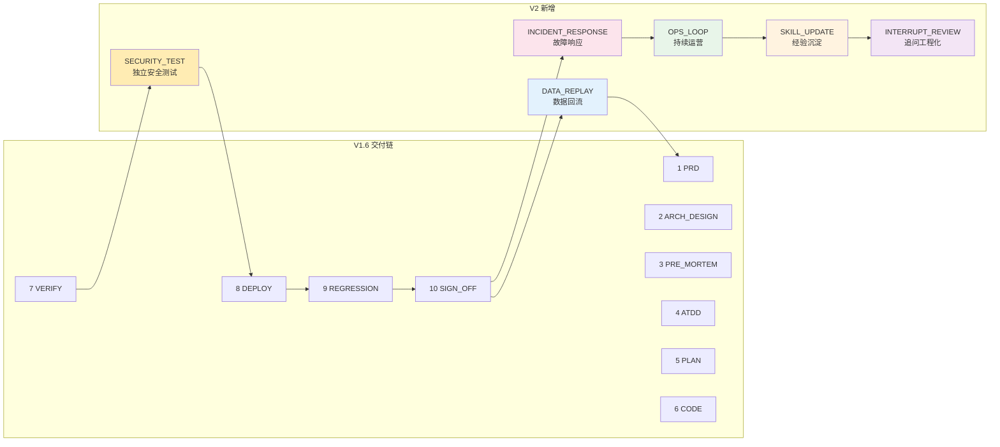

# SelfwellAgent Harness 工程体系说明

> **当前状态**：V1.6 活跃（10 phase），V2 草稿（16 phase，待 W4 切换）。
>
> **阅读说明**：第一次看按顺序读第一章至第五章；之后查问题翻第六章速查表。

---

## 第一章：Harness 是什么

**Harness 是一条强制 AI 写代码时按固定步骤走完的流水线。**

你给一个功能需求（"我要做 XX"），它强制 AI 走完：

```
PRD 需求 → 方案设计 → 多视角风险评审 → 验收用例
  → 实施计划 → 写代码（RED→GREEN→REFACTOR）
  → 质量门禁（L0-L6） → 部署预发 → 全量回归 → 最终签字
  → 上线后：故障响应 → 持续运营 → 经验沉淀
```

每一步有**专人负责**，每一步留下**证据文件**，下一步只看上一步的证据，不看聊天记录。

---

## 第二章：四种角色怎么分工

| 角色类型 | 像谁 | 干啥 | 不干啥 |
|---------|------|------|-------|
| **Dispatcher**（调度员） | 项目经理 | 看当前状态，决定下一步该叫谁 | 不写代码、不评内容 |
| **Orchestrator**（合成员） | 部门总监 | 把多角色意见合并成一份，有冲突找你拍板 | 不写代码、不替代评审员下结论 |
| **Reviewer**（评审员） | 各部门负责人 | 各自从业务/技术/质量/安全/部署视角提意见 | 不写代码、不互相合并 |
| **Executor**（执行员） | 开发/测试/运维 | 实际写代码、跑测试、部署 | 不评审别人的方案 |

---

## 第三章：当前 10 步流水线（V1.6 活跃）


### 3.1 每步谁做什么

| 步 | 中文名 | 角色 | 产出证据 | 完成标准 |
|----|--------|------|---------|---------|
| 1 | PRD | requirement-analyst | `01-requirement.md` | FR 编号全、场景拆解齐 |
| 2 | 架构设计 | tech-architect | `02-tech-design.md` | ADR 对齐、TDS 骨架出 |
| 3 | 多视角评审 | 5 reviewer + orchestrator | `04-pre-mortem.md` | 3 必签 + 2 触发式全签字 |
| 4 | ATDD | quality-guardian | `harness/atdd/ATDD-*.md` | 覆盖正常/边界/异常三态 |
| 5 | 计划 | plan-generator | `05-plan.md` | 步骤有序、有回滚方案 |
| 6 | CODE | developer | `06-code.md` + 代码 | L0-L4 PASS、覆盖率达标 |
| 7 | VERIFY | verifier | `05-verification.md` | L0-L6 全 PASS |
| 8 | DEPLOY | deployer | `06-deploy.md` | 预发健康检查 PASS |
| 9 | REGRESSION | tester | `07-regression.md` | Golden Set 跌幅 ≤ 5% |
| 10 | SIGN_OFF | orchestrator | `99-signoff.md` | commit 含 FR 编号 |

### 3.2 特殊步骤 3 和 10

步骤 3（PRE_MORTEM）和步骤 10（SIGN_OFF）需要**多个角色参与**，由 Orchestrator 合并意见：

```
5 个评审员各自写一份 → Orchestrator 合成一份 → 有冲突找你拍板
```

---

## 第四章：V2 扩展（16 phase，待 W4 切换）

> **V2 是未来状态**，当前系统仍走 V1.6（10 phase）。
> 预计 W4（2026-08-14）切换到 V2。

V2 在 V1.6 基础上增加 6 个 phase：



**V2 核心变化**：

| 新增 phase | 解决什么问题 |
|-----------|------------|
| `SECURITY_TEST` | 安全不再是 PRE_MORTEM 附庸，有独立评审 + bandit 扫描 |
| `DATA_REPLAY` | 上线后数据回流到下一轮 PRD，形成产品迭代闭环 |
| `INCIDENT_RESPONSE` | 线上故障有正式响应流程，不再靠临时救火 |
| `OPS_LOOP` | 灰度 / A/B / 持续运营指标监控 |
| `SKILL_UPDATE` | lesson → pattern → instinct 三级晋升机制落地 |
| `INTERRUPT_REVIEW` | 用户追问有正式记录，每 run 最多 5 次追问，超出升级用户 |

### V2 中断机制

```
每 run 追问 budget = 5 次
  → 任何 phase 可被打断
  → 触发 INTERRUPT_REVIEW 记录决策
  → 超出 5 次 → AskUser 升级
  → replay_session_id 追踪追问来源
```

---

## 第五章：文件都放在哪

```
harness/                    流水线状态、证据、模板、上下文
agents/harness/                   4 份角色协议（Dispatcher / Orchestrator / Reviewers / Executors）
.cursor/skills/                  10 个 Skill（每次 AI 工作时会先读）
.github/workflows/               CI/CD（backend-ci.yml / pr-gate.yml）
```

### 5.1 harness/ 目录

| 子目录 | 作用 |
|--------|------|
| `workflow.yaml` | V1.6 状态机定义（当前活跃） |
| `workflow-v2.yaml` | V2 状态机定义（16 phase，待 W4 切换） |
| `state/harness-state.json` | 当前跑到哪一步的进度条 |
| `evidence/` | 每步产出的证据文件（签字用） |
| `atdd/` | ATDD 验收用例（每个 FR 一份） |
| `templates/` | evidence 模板 |
| `context/phase-checklist.md` | 每步的只读清单 |
| `lessons/` | 实战踩坑记录（W4 后启用） |

### 5.2 agents/harness/ 协议文件

| 文件 | 角色 |
|------|------|
| `DISPATCHER.md` | 调度员守则（状态机路由） |
| `ORCHESTRATOR.md` | 合成员守则（跨角色合成） |
| `REVIEWERS.md` | 5 个评审员守则 |
| `EXECUTORS.md` | 5 个执行员守则 |

### 5.3 CI 守门

| 文件 | 守什么 |
|------|--------|
| `backend-ci.yml` | L0-L4 质量门禁（ruff / mypy / pytest / Golden Set / OpenAPI） |
| `pr-gate.yml` | 业务守门（Commit 格式 / FR 关联 / 验收测试 / ADR 冲突 / 覆盖率 / PR 大小） |
| `harness-ci.yml` | harness/ 协议完整性检查 |

---

## 第六章：质量门禁（L0-L6）

| 级别 | 检查什么 | 命令 |
|------|---------|------|
| L0 | 语法 + 格式化 | `uv run ruff check . --fix && uv run ruff format --check .` |
| L1 | 单元测试 | `uv run pytest tests/unit -x -q` |
| L2 | 静态类型 | `uv run mypy --strict app/` |
| L3 | 集成测试 | `uv run pytest tests/integration -x -q` |
| L4 | 安全扫描 | `uv run ruff check . --select=F401,F811,S608,S307,SEC,B,B003` |
| L6 | 覆盖率 | `uv run pytest --cov=app --cov-fail-under=60` |

---

## 第七章：如何启动 Harness

### 场景 A：从零开始新 FR

```
你："按 Harness 跑 FR-XXX，从需求评审开始"
AI：（读状态文件，发现还没开始）
  → 调度员初始化一轮
  → 叫"业务评审员"做第一步
  → 等评审员写完 evidence 后告诉你"下一步"
```

### 场景 B：跳过已完成步骤

```
你："按 Harness 跑 FR-XXX，需求/方案/评审都写好了，从排计划开始"
AI：（读状态文件，发现没初始化）
  → 问你"要跳过哪些步骤"
你："跳过前四步"
AI：在状态文件里记录跳过状态
  → 直接从第五步"排开发计划"开始
```

---

## 第八章：工程红线（5 条）

任何 AI 操作都不能违反：

| 编号 | 红线 | 触发后果 |
|------|------|---------|
| **R-1** | 不在 `pyproject.toml` 声明依赖 | CI 失败 |
| **R-2** | 在 `agents/harness/` 写业务规则（`if 分数 > 0.8`） | PR-Gate 拒绝 |
| **R-3** | 改完代码不跑 L0~L6 就提交 | pre-commit 拦截 |
| **R-4** | 改了 Prompt 但没跑 Golden Set 回归 | PR-Gate 拒绝 |
| **R-5** | 改文件用 shell 命令（cat / sed / echo） | 钩子硬拦截 |

---

## 第九章：Skill 体系

| Skill | 何时触发 | 干啥 |
|-------|---------|------|
| `harness-dispatcher` | 你说"按 Harness 跑" | 调度员工作流 |
| `harness-business-interview` | 你在流水线里追问业务问题 | 结构化澄清 + 5 类路由 |
| `harness-evidence` | 需要写 evidence 文件 | evidence 格式规范 |
| `harness-review` | 进入 PRE_MORTEM 步骤 | 5 角色评审工作流 |
| `harness-autolearn` | PR 合入后 | lesson → pattern → instinct 沉淀 |
| `coding-standards` | 编写 Python 代码 | 编码规范 + L0-L6 门禁 |
| `golden-set` | 改 Prompt / 跑回归 | Golden Set 维护 + Eval Runner |
| `ad-tdd` | 实施 FR 编码 | RED→GREEN→REFACTOR 循环 |
| `frontend-standards` | 编写 Flutter / 小程序代码 | 前端规范 |
| `pr-gate` | PR 失败时 | 解读 CI 日志 / 怎么重跑 |

---

## 第十章：当前 W1 待办（启动清单）

> 这些是让 Harness 从"纸面"变成"可用"的最少行动。

### W1 P0（本周）

- [ ] **跑 1 个真实 FR 走完 V1.6 1→10 全流程**（产生第一批 evidence 文件）
- [ ] `pr-gate.yml`（已起草）—— 接入 CI
- [ ] `EXECUTORS.md` verifier 修复（`--fix` → `--check`）—— 已完成
- [ ] `ad-tdd/SKILL.md` P0-1/2/3 修复（RED 验证 + 循环 commit）—— 已完成
- [ ] `project-prohibitions.mdc` R-4 真源严谨化—— 已完成

### W4 P1（4 周内）

- [ ] 错误码规范从 `coding-standards` 迁到 `docs/api/SKILL.md`
- [ ] V1.6 → V2 切换（workflow-v2.yaml + 配套文件全部改完）
- [ ] Eval Runner 接 CI（prompt 改动时自动触发）
- [ ] V3 技术架构文档加目录 + H1 锚点

### W12 P2（12 周内）

- [ ] V2 6 个新增 phase（SECURITY_TEST / DATA_REPLAY / INCIDENT_RESPONSE / OPS_LOOP / SKILL_UPDATE / INTERRUPT_REVIEW）全部落地
- [ ] L3 记忆层（埋点中间件 + PostgreSQL 事件表 + 数据回流）
- [ ] 经验沉淀机制（lesson → pattern → instinct 三级晋升）

---

## 附录：版本

| 版本 | 日期 | 说明 |
|------|------|------|
| V2 draft | 2026-07-18 | 16 phase 状态机草稿，待 W4 切换 |
| V1.6 | 2026-07-18 | 当前活跃，10 phase |
| V1.5 | 2026-07-17 | 新增现状 vs 参考图速查 |
| V1.0 | 2026-07-17 | 初版 |
