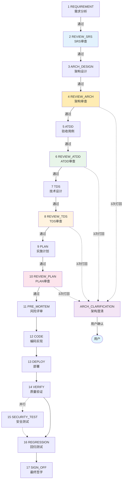

# SelfwellAgent Harness 工程体系说明

> **当前状态**：V3 Draft（24 phase，含 Review 机制 + TDS 阶段）
>
> **核心变化**：新增 Review 节点（每个阶段后）+ 新增 TDS 阶段 + 3次打回机制 + 架构澄清机制
>
> **阅读说明**：第一次看按顺序读第一章至第五章；之后查问题翻第六章速查表。

---

## 第一章：Harness 是什么

**Harness 是一条强制 AI 写代码时按固定步骤走完的流水线。**

你给一个功能需求（"我要做 XX"），它强制 AI 走完：

```
PRD 需求 → SRS 文档
  → 架构设计文档
  → ATDD 验收用例
  → TDS 技术设计规范（新增）
  → 实施计划
  → 风险评审
  → 写代码（RED→GREEN→REFACTOR）
  → 质量门禁（L0-L6） → 部署预发 → 全量回归 → 最终签字
  → 上线后：故障响应 → 持续运营 → 经验沉淀
```

每一步有**专人负责**，每一步留下**证据文件**，下一步只看上一步的证据，不看聊天记录。

**V3 核心创新**：
- 每个阶段后有 **Review 节点**（分层深度：轻/中/重）
- Review 不通过 → 最多改 3 次 → 仍不通过 → **架构澄清**
- 新增 **TDS 阶段**（ATDD 与 PLAN 之间的技术桥梁）

---

## 第二章：四种角色怎么分工

| 角色类型 | 像谁 | 干啥 | 不干啥 |
|---------|------|------|-------|
| **Dispatcher**（调度员） | 项目经理 | 看当前状态，决定下一步该叫谁 | 不写代码、不评内容 |
| **Orchestrator**（合成员） | 部门总监 | 把多角色意见合并成一份，有冲突找你拍板 | 不写代码、不替代评审员下结论 |
| **Reviewer**（评审员） | 各部门负责人 | 各自从业务/技术/质量/安全/部署视角提意见 | 不写代码、不互相合并 |
| **Executor**（执行员） | 开发/测试/运维 | 实际写代码、跑测试、部署 | 不评审别人的方案 |

---

## 第三章：V3 完整流程（24 phase）

### 3.1 流程架构图



### 3.2 Review 分层策略

| Review 节点 | 负责角色 | 深度 | 主要检查点 |
|-------------|----------|------|-----------|
| **REVIEW_SRS** | requirement-analyst | 中等 | FR 编号完整、场景覆盖、唯一真源 |
| **REVIEW_ARCH** | tech-architect | **重度** | 架构方案选择、涉及变更需与用户澄清 |
| **REVIEW_ATDD** | quality-guardian | 轻量 | 场景格式、Given-When-Then、覆盖度 |
| **REVIEW_TDS** | tech-architect | 中等 | 与 ATDD 对齐、技术可行、架构一致 |
| **REVIEW_PLAN** | plan-generator | 轻量 | 实施步骤可落地性、依赖关系、DDD 规范 |

### 3.3 对齐检查标准（三维度）

每个 Review 节点必须验证以下三个维度：

| 维度 | 检查内容 | 结果 |
|------|----------|------|
| **唯一真源** | 不存在多处真源，真实存在 | PASS / WARN / FAIL |
| **业务对齐** | 与 PRD/SRS 的业务需求一致 | PASS / WARN / FAIL |
| **技术对齐** | 与架构设计文档一致 | PASS / WARN / FAIL |

### 3.4 3次打回机制

```
Review 打回 → 开发修改 → Review 打回 → 开发修改 → Review 第3次仍不通过
     ↓
触发 ARCH_CLARIFICATION（架构澄清）
     ↓
由 tech-architect 向用户说明卡点 + 给出选项建议
     ↓
用户确认方案后，更新文档，再次 Review
```

**关键约束**：
- 每次打回记录 `rejection_count`
- 3次打回后触发 `ARCH_CLARIFICATION`，不消耗 `interrupt_budget`
- `ARCH_CLARIFICATION` 是正式流程节点，有独立的 evidence 文件

### 3.5 架构变更分层处理

| 变更类型 | 定义 | 处理方式 |
|----------|------|----------|
| **核心架构变更** | 涉及 `tech-architecture-design-v3.md` 的架构决策变化 | 必须与用户澄清，给出选项 |
| **引用文档变更（重大）** | 涉及 agents/ 目录结构变化、接口契约变化 | 必须与用户澄清 |
| **引用文档变更（一般）** | 文档内容更新但不影响架构 | 由 Review 节点直接审核 |

---

## 第四章：V3 与 V2 对比

### 4.1 核心变化

| 维度 | V2 | V3 |
|------|-----|-----|
| **流程** | 10 phase（PRE_MORTEM 在 ATDD 前） | 24 phase（新增 4 个 Review + TDS + ARCH_CLARIFICATION） |
| **Review** | 无独立 Review 节点 | 每个阶段后有 Review 节点 |
| **TDS** | 无 | 新增 TDS 阶段（ATDD → TDS → PLAN） |
| **打回机制** | 无限制 | 最多 3 次，触发架构澄清 |
| **PRE_MORTEM 位置** | ARCH_DESIGN 后 | PLAN 前 |

### 4.2 task_type 映射

| task_type | feature | bugfix | refactor | doc-fix | perf-optimize |
|-----------|---------|--------|----------|---------|---------------|
| **REVIEW 节点** | ✅ 全部 | ❌ | ❌ | ❌ | ❌ |
| **TDS** | ✅ | ❌ | ❌ | ❌ | ❌ |

### 4.3 Review 节点与 task_type

| task_type | REVIEW_SRS | REVIEW_ARCH | REVIEW_ATDD | REVIEW_TDS | REVIEW_PLAN |
|-----------|------------|-------------|-------------|-------------|-------------|
| feature | ✅ | ✅ | ✅ | ✅ | ✅ |
| bugfix | ❌ | ❌ | ❌ | ❌ | ❌ |
| refactor | ❌ | ❌ | ❌ | ❌ | ✅ |
| perf-optimize | ❌ | ❌ | ❌ | ❌ | ✅ |

---

## 第五章：文件都放在哪

```
harness/                    流水线状态、证据、模板、上下文
├── workflow-v3.yaml        V3 状态机定义（24 phase）
├── state/
│   └── harness-state.json  当前跑到哪一步的进度条
├── evidence/               每步产出的证据文件
│   ├── 01-requirement.md
│   ├── review-srs.md       # Review 证据
│   ├── 02-tech-design.md
│   ├── review-arch.md      # Review 证据
│   ├── 03-atdd.md
│   ├── review-atdd.md      # Review 证据
│   ├── 04-tds.md          # TDS 证据
│   ├── review-tds.md       # Review 证据
│   ├── 05-plan.md
│   ├── review-plan.md      # Review 证据
│   ├── arch-clarification.md  # 架构澄清证据
│   └── ...
├── atdd/                  ATDD 验收用例（每个 FR 一份）
├── templates/             evidence 模板
├── context/
│   └── phase-checklist.md 每步的只读清单
└── lessons/               实战踩坑记录
```

---

## 第六章：测试分层与执行策略

### 6.1 测试金字塔

```
┌──────────────────────────────────────────────────────┐
│ UI-E2E：Playwright（Web） + 微信开发者工具 MCP       │  ← REGRESSION
├──────────────────────────────────────────────────────┤
│ API-E2E：pytest tests/e2e/                          │  ← VERIFY + REGRESSION
├──────────────────────────────────────────────────────┤
│ Integration：pytest tests/integration/                │  ← VERIFY
├──────────────────────────────────────────────────────┤
│ Smoke：pytest tests/smoke/                           │  ← VERIFY + REGRESSION
├──────────────────────────────────────────────────────┤
│ Golden Set：Eval Runner                              │  ← REGRESSION
└──────────────────────────────────────────────────────┘

        ATDD：产出 Given-When-Then（验收标准，不跑自动化）
        TDS：产出技术实现规范（供 PLAN 使用）
```

### 6.2 执行阶段矩阵

| 阶段 | integration | API-E2E | smoke | UI-E2E | Golden Set |
|------|:-----------:|:--------:|:-----:|:------:|:----------:|
| **VERIFY** | ✅ | ✅ | ✅ | ✅* | ❌ |
| **REGRESSION** | ❌ | ✅ | ✅ | ✅ | ✅ |

*UI-E2E 在 VERIFY 阶段为**可选**（资源充足时执行）

---

## 第七章：质量门禁（L0-L6）

| 级别 | 检查什么 | 命令 |
|------|---------|------|
| L0 | 语法 + 格式化 | `uv run ruff check . --fix && uv run ruff format --check .` |
| L1 | 单元测试 | `uv run pytest tests/unit -x -q` |
| L2 | 静态类型 | `uv run mypy --strict app/` |
| L3 | 集成测试 | `uv run pytest tests/integration -x -q` |
| L4 | 安全扫描 | `uv run ruff check . --select=F401,F811,S608,S307,SEC,B,B003` |
| L6 | 覆盖率 | `uv run pytest --cov=app --cov-fail-under=60` |

---

## 第八章：工程红线（5 条）

任何 AI 操作都不能违反：

| 编号 | 红线 | 触发后果 |
|------|------|---------|
| **R-1** | 不在 `pyproject.toml` 声明依赖 | CI 失败 |
| **R-2** | 在 `agents/harness/` 写业务规则（`if 分数 > 0.8`） | PR-Gate 拒绝 |
| **R-3** | 改完代码不跑 L0~L6 就提交 | pre-commit 拦截 |
| **R-4** | 改了 Prompt 但没跑 Golden Set 回归 | PR-Gate 拒绝 |
| **R-5** | 改文件用 shell 命令（cat / sed / echo） | 钩子硬拦截 |

---

## 第九章：Skill 体系

| Skill | 何时触发 | 干啥 |
|-------|---------|------|
| `harness-dispatcher` | 你说"按 Harness 跑" | 调度员工作流 |
| `harness-business-interview` | 你在流水线里追问业务问题 | 结构化澄清 + 5 类路由 |
| `harness-evidence` | 需要写 evidence 文件 | evidence 格式规范 |
| `harness-review` | 进入 Review 步骤 | Review 评审工作流 |
| `harness-autolearn` | PR 合入后 | lesson → pattern → instinct 沉淀 |
| `coding-standards` | 编写 Python 代码 | 编码规范 + L0-L6 门禁 |
| `golden-set` | 改 Prompt / 跑回归 | Golden Set 维护 + Eval Runner |
| `ad-tdd` | 实施 FR 编码 | RED→GREEN→REFACTOR 循环 |
| `frontend-standards` | 编写 Flutter / 小程序代码 | 前端规范 |
| `pr-gate` | PR 失败时 | 解读 CI 日志 / 怎么重跑 |

---

## 第十章：启动 Checklist

### W1 P0（本周）

- [ ] **Review 节点落地**（创建 `harness/evidence/review-*.md` 模板）
- [ ] **TDS 阶段落地**（创建 `harness/evidence/04-tds.md` 模板）
- [ ] **ARCH_CLARIFICATION 阶段落地**（创建 `harness/evidence/arch-clarification.md` 模板）
- [ ] **dispatcher 路由更新**（支持 V3 的 24 phase 路由）

### W2 P1

- [ ] **跑 1 个真实 FR 走完 V3 全流程**
- [ ] **Review 3次打回机制验证**

---

## 附录：版本

| 版本 | 日期 | 说明 |
|------|------|------|
| V3 draft | 2026-07-24 | 新增 Review 机制 + TDS 阶段 + 3次打回 + 架构澄清 |
| V2 | 2026-07-18 | 16 phase 状态机 |
| V1.6 | 2026-07-18 | 当前活跃，10 phase |
| V1.5 | 2026-07-17 | 新增现状 vs 参考图速查 |
| V1.0 | 2026-07-17 | 初版 |
