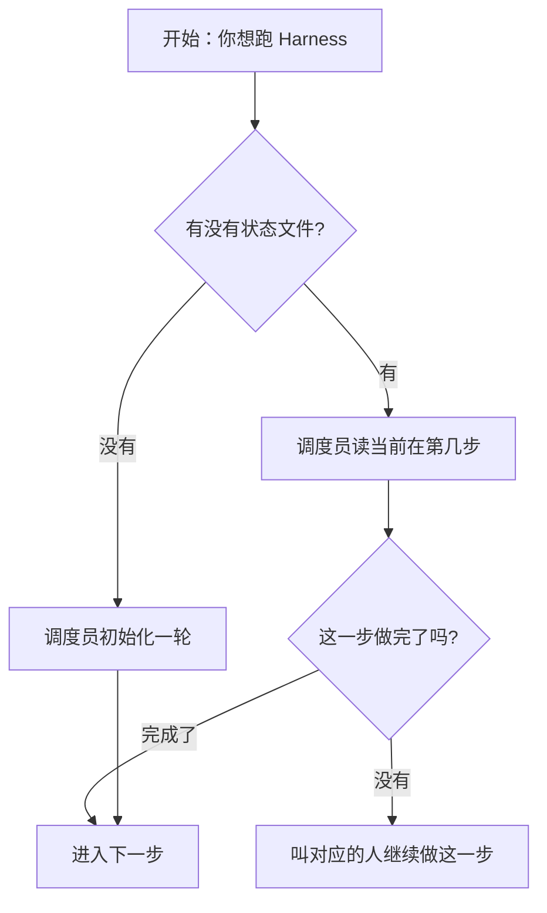
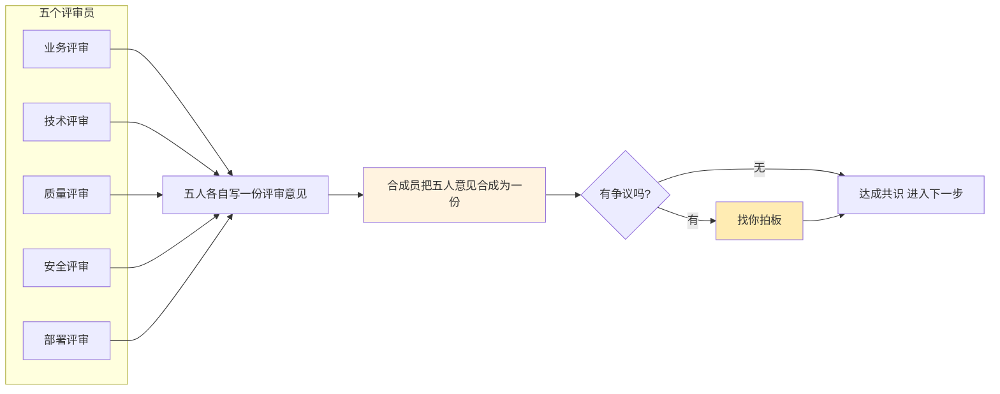

# Harness 工程体系说明

> **这是什么**：一份给"想用 Harness 跑功能开发的人"写的入门 + 速查文档。
> **怎么读**：第一次看，按顺序读完前三章（5 分钟）；之后查问题，翻第六章、第七章。
> **当前版本 V1.6（2026-07-18，A 档精简版）**：核心骨架 13 文件，4 协议 + 2 Skill 减肥到 ≤ 150 / ≤ 100 行，frontmatter 7→6 字段，Pre-Mortem 5→3 签字，6 模板合 4，4 context 合 1。详见 §十二 精简对比表。
> **B 档延后评估**：跑 1 月后视数据决定是否进一步精简（见 §十三）。

---

## 第一章：Harness 是什么（一句话版）

**Harness 是一条让 AI 帮你写代码时、按固定步骤走完流程的"流水线"。**

你给一个功能需求（"我要做 XX"），它会强制让 AI 走完：

```
明确要做什么  →  设计怎么实现  →  多角度评审风险  →  写验收用例  →  排开发计划
   →  写代码  →  跑测试  →  部署预发  →  全量回归  →  最终签字
```

每一步都有**专人负责**（我们叫"角色"），每一步都要**留下证据**（我们叫"evidence 文件"），下一步的人只看上一步的 evidence，不看聊天记录。

这套机制的目的：让 AI 写代码**不漏步骤**、**不跳评审**、**不混淆职责**。

---

## 第二章：直观图（一图看懂）

### 图 1：Harness 流水线全景


**怎么读这张图**：

- 蓝色步骤（1、2、4、5）→ 1 个角色做，产出一份 evidence 文件
- 橙色步骤（3、10）→ 多个角色参与，需要"合成员"把意见合并，有冲突要找你拍板
- 绿色步骤（6、7、8、9）→ 实际写代码 + 跑测试 + 上线

每一步的具体动作见第六章。

---

### 图 2：调度员怎么决定"现在轮到谁"



**这是"调度员"（Dispatcher）的工作**：每次你说"下一步"，它看一眼当前状态，决定该叫谁。

调度员**不写代码**、**不写文档**、**不评估内容质量**，只做一件事——**找到下一步该工作的人**。

---

### 图 3：第三步（多视角风险评审）和第十步（最终签字）的特殊流程



**为什么第三步和第十步特别？** 因为这两步需要把多个角色的意见**合到一起**——可能一致、可能冲突，所以专门有个"合成员"角色来做合成，有冲突就找你拍板。其他步骤只有 1 个角色参与，不存在合并问题。

---

## 第三章：四种角色怎么分工

Harness 有 4 类角色，**互不重叠**：

| 角色类型 | 像公司里的谁 | 干啥 | 不干啥 |
|---------|------------|------|--------|
| **调度员（Dispatcher）** | 项目经理 | 看当前状态，决定下一步该叫谁 | 不写代码、不写文档、不评估内容 |
| **合成员（Orchestrator）** | 部门总监 | 把多人的意见合并成一份，有冲突找你拍板 | 不写代码、不替代评审员下结论 |
| **评审员（Reviewer）** | 各部门负责人（业务/技术/质量/安全/部署） | 各自从一个视角看方案，提意见 | 不写代码、不互相合并意见 |
| **执行员（Executor）** | 开发/测试/运维工程师 | 实际写代码、跑测试、部署 | 不评审别人的方案 |

**关键约束**：每种角色**只看自己工作需要的资料**——评审员不读别的评审员的 evidence（避免互相影响），执行员不读评审 evidence（避免被预设意见带偏）。这就是"上下文隔离"。

---

## 第四章：文件都放在哪

所有 Harness 相关的文件集中在 3 个地方：

```
harness/          流水线状态、证据、模板、上下文
agents/harness/         4 份角色协议（调度员/合成员/评审员/执行员各自的规矩）
.cursor/skills/         5 个 Skill（每次 AI 工作时会先读）
```

### 4.1 harness/ 目录下都有什么

| 子目录 | 作用 | 谁读 |
|--------|------|------|
| `workflow.yaml` | 流水线定义（10 步 + 每步该叫谁） | 调度员 |
| `state/harness-state.json` | 当前跑到哪一步的"进度条" | 调度员 |
| `evidence/` | 每一步产出的"证据文件"（签字用） | 合成员、各角色 |
| `atdd/` | 验收用例（每个 FR 对应一份） | 评审员、执行员 |
| `templates/` | 各种文件模板 | 评审员、合成员 |
| `context/` | 每一步的"只读清单"（告诉 AI 这步能读啥、不能读啥） | AI 每步开始时按需读 |
| `lessons/` | 实战踩坑记录（沉淀经验用） | 调度员触发 / PR 合入后 |

### 4.2 agents/harness/ 目录下都有什么

4 份 Markdown 文件，对应 4 种角色协议：

- `DISPATCHER.md` — 调度员守则
- `ORCHESTRATOR.md` — 合成员守则
- `REVIEWERS.md` — 5 个评审员各自的守则
- `EXECUTORS.md` — 5 个执行员各自的守则

### 4.3 .cursor/skills/ 下 Harness 相关 Skill

| Skill | 何时触发 | 干啥 |
|-------|---------|------|
| `harness-dispatcher` | 你说"按 Harness 跑" | 调度员工作流 |
| `harness-evidence` | 需要写 evidence 文件 | 证据文件格式规范 |
| `harness-review` | 进入第三步 | 评审员工作流 |
| `harness-autolearn` | PR 合入后 | 沉淀实战经验 |

---

## 第五章：实际怎么用

### 场景 A：我有个新需求要从零开始

```
你："按 Harness 跑 FR-XXX，从需求评审开始"

AI：（读状态文件，发现还没开始）
     → 调度员初始化一轮
     → 叫"业务评审员"做第一步
     → 等业务评审员写完 evidence 文件后告诉你"下一步"

你："下一步"

AI：调度员看证据文件已就绪
   → 叫"技术评审员"做第二步
   ...

（依次推进，直到第十步签字完）
```

### 场景 B：我已经写了 PRD、技术方案、验收用例，只差排计划和写代码

```
你："按 Harness 跑 FR-XXX，需求/技术/评审/验收用例都写好了，从排计划开始"

AI：（读状态文件，发现没初始化过）
     → 调度员说"我先初始化，请确认要跳过哪些步骤"
你："跳过前四步"
AI：（在状态文件里记录：跳过 PRD/设计/评审/验收用例四步）
     → 直接从第五步"排开发计划"开始
```

**关键点**：你必须**明确告诉 AI 跳过了哪几步**——AI 不会自己去判断"我是不是已经做过这一步"。

### 场景 C：我写到一半发现某步有问题，想退回上一步

```
抱歉，Harness 不支持回退。

如果你发现问题，标准做法是：
1. 写一个新意见留在当前步（不签字）
2. 状态文件会保持当前步不推进
3. 等问题修了，再让 AI 继续做这一步
```

### 场景 D：我只想修个 bug，不想走全流程

```
修 bug、跑单测、查代码——这些不需要 Harness。
Harness 只用于"做一个新功能从 0 到上线的完整流程"。
修 bug 直接走 .cursor/skills/coding-standards 就行。
```

---

## 第六章：每一步谁做什么、留下什么

Harness 里每个步骤会产出两类东西：

- **业务文档**：TDS、ATDD 用例、代码——这些是需求/设计的直接产物，不属于 Harness 管理体系
- **Harness 证据文件**：evidence 文件——这是流水线自己要求的"签字档案"，下一步的人只看这些

下表把两类产出**同时列清楚**，避免你以为"这步只要写个 evidence 文件就行了"。

### 6.1 流水线 10 步全景

| 步骤 | 中文名 | 谁做 | 干啥 | 业务文档产出 | Harness 证据文件 | 怎么算完成 |
|------|--------|------|------|-------------|-----------------|-----------|
| 1 | 明确需求 | **业务评审员** | 把你的需求翻译成 FR 编号 + 拆解使用场景 | 无（只读 PRD / scenarios） | `evidence/01-requirement.md` | 每个 FR 都有 ≥1 个使用场景 |
| 2 | 设计技术方案 | **技术评审员** | 写 TDS（模块拆分/依赖/数据流） | `docs/spec/TDS-<id>.md`（新建或追加章节） | `evidence/02-tech-design.md` | TDS 骨架完成、与 V3 架构无冲突 |
| 3 | 多视角风险评审 | **5 个评审员**（业务/技术/质量/安全/部署）各自写一份 + **合成员**合并 | 5 个视角各出一份评审意见，合成员汇总 | 无 | `evidence/03-quality.md`（质量视角）<br>`evidence/03b-security.md`（安全视角）<br>`evidence/03c-devops.md`（部署视角）<br>`evidence/04-pre-mortem.md`（合成员合成报告） | 5 人都签字、合成报告里无未解决问题 |
| 4 | 写验收用例 | **质量评审员** | 用 Given-When-Then 格式写 ATDD 验收用例 | `harness/atdd/ATDD-<id>-AC.md`（新建） | `evidence/03-quality.md`（补充 ATDD 覆盖说明，与第 3 步合并） | 用例覆盖正常/边界/异常三态 |
| 5 | 排开发计划 | **计划员** | 列出实施步骤顺序、回滚点、PR 拆点 | `docs/spec/TDS-<id>.md`（末尾追加"实施计划"章节） | `evidence/05-plan.md` | 步骤有序、有回滚方案 |
| 6 | 写代码 | **开发员** | 严格走 RED→GREEN→REFACTOR（先写失败测试→写最简实现→重构） | `backend/app/` 或 `apps/` 下业务代码<br>`backend/tests/unit/` 下单元测试 | `evidence/06-code.md` | L0~L4 全 PASS、覆盖率达标 |
| 7 | 跑质量门禁 | **测试员（verifier）** | 跑 L0~L6 六道关卡 | 无（只跑命令，不写业务文件） | `evidence/05-verification.md` | L0~L6 全 PASS + PR-Gate 7 项全通过 |
| 8 | 部署预发 | **部署员** | 部署到预发环境、跑数据库迁移 | 无（跑 docker compose / alembic） | `evidence/06-deploy.md` | 预发健康检查通过、迁移成功 |
| 9 | 全量回归 | **测试员（tester）** | 跑 Golden Set 回归 + e2e | 无（跑 eval.runner） | `evidence/07-regression.md` | Golden Set 跌幅 ≤5%、e2e 全 PASS |
| 10 | 最终签字 | **5 个角色各自签字** + **合成员**写合并报告 | 汇总所有意见、写最终签字 | `commit` + `PR 描述`（PR 里包含 FR 编号） | `evidence/05-acceptance.md` + 合成报告 | commit/PR 含 FR 编号、流水线结束 |

### 6.2 业务文档由谁写（人 vs AI 的分界）

先回答你这个问题：**SRS / TDS / ATDD 这些业务文档，到底是谁写的？**

Harness 里有两类文档，作者完全不同：

| 类别 | 含义 | 例子 | 谁写 | 什么时候写 |
|------|------|------|------|-----------|
| **业务文档** | 描述"要做什么 / 怎么实现 / 怎么验收"的实际文档 | PRD、SRS、TDS、ATDD 用例、代码 | **人**（产品 / 架构师 / QA / 开发） | 在 Harness 流水线**之外**写好 |
| **Harness 证据文件** | 流水线的"会议纪要 / 签字档案"，证明每步走过了 | `evidence/*.md` | **AI**（按角色协议） | 在 Harness 流水线**之内**自动产出 |

**关键区别**：业务文档是"人提前写好的输入"，evidence 是"AI 在流水线里自动产生的输出"。

具体的对应关系：

| 业务文档 | 路径 | 谁负责写 | 何时写 | 在 Harness 哪步被使用 |
|---------|------|---------|--------|---------------------|
| **PRD**（产品需求） | `docs/PRD/` | 产品经理 | 立项时（流水线启动前） | 步骤 1 读它来拆 FR |
| **Scenarios**（用户场景） | `docs/scenarios/` | 产品经理 / BA | 需求阶段 | 步骤 1 读它来拆 FR |
| **SRS**（软件需求规格） | `docs/requirements/SELFWELL-MVP-SRS.md` | 架构师 / 产品 | 需求阶段 | 步骤 1 读它来对齐 FR 边界 |
| **TDS**（技术设计文档） | `docs/spec/TDS-<id>.md` | 架构师 | 步骤 2 内由 AI 起草，**架构师审阅 / 定稿** | 步骤 2 产出 → 步骤 5 追加实施计划 |
| **ATDD 验收用例**（Gherkin Given-When-Then） | `harness/atdd/ATDD-<id>-AC.md` | QA 工程师 | 步骤 4 内由 AI 起草，**QA 审阅 / 定稿** | 步骤 4 产出 → 步骤 6/7 拿来对照 |
| **单元测试代码** | `backend/tests/unit/` | 开发员 | 步骤 6 内由 AI 写 RED→GREEN，**开发员 review** | 步骤 6 产出 |
| **业务代码** | `backend/app/`、`apps/` | 开发员 | 步骤 6 内由 AI 写实现，**开发员 review** | 步骤 6 产出 |
| **PR 描述** | GitHub PR | 开发员 | 步骤 10 由 AI 起草，**开发员提交** | 步骤 10 产出 |

**一句话总结**：Harness 让 AI **起草**这些文档，但**最终责任人还是人**。AI 是帮你写初稿、跑检查的实习生，最终签字的是产品 / 架构师 / QA / 开发。

---

### 6.3 证据文件清单（都在 harness/evidence/ 下）

```
harness/evidence/
├── 01-requirement.md       ← 步骤 1，业务评审员写
├── 02-tech-design.md       ← 步骤 2，技术评审员写
├── 03-quality.md           ← 步骤 3 质量视角 + 步骤 4 补充（一文件两人用）
├── 03b-security.md         ← 步骤 3 安全视角
├── 03c-devops.md          ← 步骤 3 部署视角
├── 04-pre-mortem.md        ← 步骤 3，合成员写的合并报告
├── 04-pre-mortem-debate.md ← 步骤 3，有冲突时才出（可选）
├── 05-plan.md              ← 步骤 5，计划员写
├── 05-verification.md      ← 步骤 7，测试员写
├── 05-acceptance.md        ← 步骤 10，最终签字
├── 06-deploy.md            ← 步骤 8，部署员写
└── 07-regression.md        ← 步骤 9，测试员写
```

> 步骤 4 的 ATDD 验收用例不在 evidence/ 里，而是在 `harness/atdd/ATDD-<id>-AC.md`。

---

### 6.4 质量门禁（L0~L6）

| 编号 | 检查什么 | 命令 |
|------|---------|------|
| L0 | Python 语法和导入 | `uv run ruff check . --fix && uv run ruff format .` |
| L1 | 单元测试 | `uv run pytest tests/unit -x -q` |
| L2 | 静态类型检查 | `uv run mypy --strict app/` |
| L3 | 集成测试 | `uv run pytest tests/integration -x -q` |
| L4 | 安全规则扫描 | `uv run ruff check . --select=F401,F811,S608,S307,SEC,B,B003` |
| L6 | 测试覆盖率 | `uv run pytest --cov=app --cov-report=term-missing`（整体 ≥60%，核心模块 ≥80%） |

---

## 第七章：常见问题

### Q1：业务文档（PRD / SRS / TDS / ATDD）到底是谁写的？

**答**：Harness 里有两类文档，作者完全不同：

- **业务文档**（PRD / SRS / TDS / ATDD / 代码）—— 由人写（产品 / 架构师 / QA / 开发）。Harness 启动前就写好，或者在流水线里由 AI **起草初稿 + 人定稿**。
- **Harness 证据文件**（`evidence/*.md`）—— 由 AI 按角色协议写。完全自动，人只看不写。

详见第六章 §6.2。

### Q2：什么是 evidence 文件？

**答**：每一步 AI 完成后，必须写一份 Markdown 文件说明"我做了什么 / 结论是什么 / 需要谁拍板什么"。

它的作用：

1. **给下一步的人当输入**（不用看聊天记录也能知道上一步的结论）
2. **签字用**（前面的人签了字，后面的人才能开始）
3. **审计用**（出问题时能追溯到是谁、什么时候、基于什么下的决定）

文件名格式：`<编号>-<主题>.md`，例如 `01-requirement.md`、`03-quality.md`。

### Q3：为什么不让 AI 自己判断下一步该干啥？

**答**：因为 AI 容易"图省事"——本来该评审的，它跳过；本来该签字的，它假装签了。

所以 Harness 强制用 `workflow.yaml` 写死每一步该叫谁，调度员只看这个文件决定下一步，**不能临时改规则**。这避免了 AI 偷懒。

### Q3：第三步（多视角评审）和第十步（最终签字）为什么特殊？

**答**：因为这两步有**多个角色参与**，可能意见不一致。

比如：技术评审说"用 Redis 缓存"，质量评审说"测试覆盖不到缓存层"。这两方不一致，需要有个人（合成员）把意见合并、列出来给你拍板。

其他步骤只有 1 个角色参与，不存在合并问题。

### Q5：evidence 文件和 PR 描述有什么区别？

**答**：

- **evidence 文件** = 过程中每一步的"会议纪要"，含 AI 思考过程和决策依据
- **PR 描述** = 最终对外的"变更说明"，含改了啥、为啥改、怎么验证

evidence 文件**不会**直接出现在 PR 里；它是流水线内部的"档案库"，事后审计或重新执行流水线时会用到。

### Q6：如果某步 evidence 写错了怎么办？

**答**：直接重写它。文件名不要改（保持编号一致），内容覆盖即可。

但**不要**把上一步的 evidence 改了来"配合"这一步——这是作弊，会被 PR-Gate 拦截。

### Q7：Harness 和现有 .cursor/skills 的关系？

**答**：

- Harness 用 .cursor/skills 里的 `coding-standards`（编码规范）、`golden-set`（回归测试）等基础能力
- Harness 自己新增了 4 个 Skill（`harness-dispatcher` / `harness-evidence` / `harness-review` / `harness-autolearn`）专门做流水线编排
- 两套机制不冲突：基础能力是"工具"，Harness 是"工作流"

---

## 第八章：核心约束（5 条红线）

任何 AI 操作都不能违反：

| 编号 | 红线 | 触发后果 |
|------|------|---------|
| R-1 | 不在 `pyproject.toml` 声明依赖 | CI 失败 |
| R-2 | 在 `agents/harness/` 写业务规则（"if 分数 > 0.8 就..."这种） | PR-Gate 拒绝 |
| R-3 | 改完代码不跑 L0~L6 就提交 | pre-commit 拦截 |
| R-4 | 改了 Prompt 但没跑 Golden Set 回归 | PR-Gate 拒绝 |
| R-5 | 改文件用 shell 命令（用 cat / sed / echo） | 系统硬拦截 |

**R-2 特别说明**：`agents/harness/` 里**只能写"工作流规则"**，不能写"业务判断规则"。比如可以写"第三步完成后才能进第四步"，但不能写"如果诊断评分 > 0.8 就推送结果"——业务规则必须放 `backend/app/rules/` 下。

---

## 第九章：经验沉淀机制（高级）

实战中踩过的坑，Harness 会自动沉淀成"经验"，避免下次再踩：

```
第 1 次踩坑 → 写一篇"踩坑记录"（lesson）
                ↓
第 2 次同类坑 → 升级为"通用模式"（pattern），写进编码规范
                ↓
第 3 次实战验证 → 升级为"硬规则"（instinct），机器自动强制执行
```

具体看 `harness/lessons/README.md`。

---

## 第十章：文档位置速查

| 你想看 | 路径 |
|--------|------|
| 完整流水线定义 | `harness/workflow.yaml` |
| **现状 vs 参考架构 Gap 对照** | **`harness/GAP-ANALYSIS.md`**（按 4 层图逐项打分） |
| 详细架构说明（V1.0 旧版） | `harness/architecture.md` |
| 状态文件示例 | `harness/state/harness-state.example.json` |
| 每步的只读清单 | `harness/context/` |
| evidence 文件规范 | `harness/evidence/README.md` |
| 合成报告模板 | `harness/templates/synthesis.md` |
| 合成报告示例 | `harness/templates/synthesis-examples.md` |
| 验收用例（ATDD） | `harness/atdd/ATDD-M*.md` |
| 经验沉淀机制 | `harness/lessons/README.md` |
| 调度员守则 | `agents/harness/DISPATCHER.md` |
| 合成员守则 | `agents/harness/ORCHESTRATOR.md` |
| 5 个评审员守则 | `agents/harness/REVIEWERS.md` |
| 5 个执行员守则 | `agents/harness/EXECUTORS.md` |
| 编码规范（被 Harness 调用） | `.cursor/rules/coding-standards.mdc` |
| Golden Set（被 Harness 调用） | `.cursor/skills/golden-set/SKILL.md` |
| V3 项目架构 | `docs/architecture/tech-architecture-design-v3.md` |
| 工程红线 | `.cursor/rules/project-prohibitions.mdc` |

---

## 附录：版本

| 版本 | 日期 | 说明 |
|------|------|------|
| V1.6 | 2026-07-18 | A 档精简：6 模板合 4（pre-mortem 含对抗辩论附录；synthesis 含 2 示例；lesson-record 含晋升机制）+ 4 context 合 1 phase-checklist.md + 2 Skill 内联进 evidence/README & REVIEWERS.md + 4 协议减肥到 ≤ 150 行 + 2 SKILL 减肥到 ≤ 100 行 + frontmatter 7→6 字段（保留 adr_refs）+ 新增 check.sh 兜底 + harness-ci.yml。详见 §十二 精简对比表 |
| V1.5 | 2026-07-17 | 新增 §0.5 现状 vs 参考图速查 + 第十一章 Gap 文档导航 |
| V1.4 | 2026-07-17 | 澄清"业务文档 vs 证据文件"两套体系：新增 §6.2 业务文档作者表 + FAQ Q1 |
| V1.3 | 2026-07-17 | 补全"每步谁写什么文档"：新增业务文档产出列 + evidence 文件清单（6.1/6.2） |
| V1.2 | 2026-07-17 | 用中文语境重写：去掉 emoji / 术语堆砌；架构图重画；新增场景化使用说明 |
| V1.1 | 2026-07-17 | 初次合并旧 architecture.md，加入 Mermaid 图 |
| V1.0 | 2026-07-17 | 初版（`architecture.md`，已移到 `.archive/`） |

---

## 第十二章：精简对比表（A 档 V1.6）

> **A 档核心**：保留防御性冗余（`adr_refs` / 3 签字 / architecture 归档）。3 项激进改动延后 1 月评估（见 §十三）。

### 12.1 文件数对比

| 维度 | 精简前 | 精简后（A 档） | 变化 |
|------|:---:|:---:|:---:|
| `harness/` 核心骨架 | 20 文件 | **13 文件** | -35% |
| `harness/atdd/*.md` | 13 份 | 13 份（保留） | 不变 |
| `agents/harness/*.md` | 4 份 × 平均 175 行 = 700 行 | 4 份 × 平均 109 行 = **436 行** | -38% |
| `.cursor/skills/harness-*/SKILL.md` | 4 份 × 平均 180 行 = 720 行 | 2 份 × 平均 76 行 = **152 行** | -79% |
| 总文件数（含 atdd） | 35 | **28** | -20% |
| **总行数（核心协议）** | **~3,500 行** | **~1,600 行** | **-54%** |

### 12.2 删/合/归档清单

| 操作 | 文件 | 备注 |
|------|------|------|
| **删除 3** | `templates/adversarial-debate.md` | 合并进 pre-mortem.md §3.5 |
| **删除 3** | `templates/synthesis-examples.md` | 合并进 synthesis.md §五 |
| **删除 3** | `lessons/README.md` | 合并进 lesson-record.md §〇 |
| **归档 1** | `architecture.md` → `.archive/architecture.md` | 老 V1.0 历史快照保留 |
| **合并 4 → 1** | `context/{prd,ad,atdd,code}-phase.md` → `phase-checklist.md` | 35 行 5 列表格 |
| **内联 2 Skill → 2 协议** | `harness-evidence/SKILL.md` → `evidence/README.md §八` | |
| | `harness-review/SKILL.md` → `agents/harness/REVIEWERS.md §十` | |

### 12.3 frontmatter 字段精简（7 → 6，保守）

| 字段 | 精简前 | 精简后 | 理由 |
|------|:---:|:---:|------|
| `phase` | ✅ | ✅ | 必填 |
| `run_id` | ✅ | ✅ | 必填 |
| `role` | — | ✅ | 合并原 `reviewer_role` + `author_agent` |
| `fr_refs` | — | ✅ | FR 映射（之前叫 `fr_id`） |
| `adr_refs` | — | ✅ | **A 档保留**（审计锚点） |
| `signed` | ✅ | ✅ | 必填 |
| ~~`reviewer_role`~~ | ✅ | ❌ | 合并进 `role` |
| ~~`author_agent`~~ | ✅ | ❌ | 合并进 `role`（冗余） |
| ~~`created_at`~~ | ✅ | → `date` | 改名对齐 lessons |
| ~~`evidence_id`~~ | ✅ | ❌ | 不再需要（run_id 已唯一） |
| ~~`fr_id`~~ | ✅ | ❌ | 改名 `fr_refs`（多值） |
| ~~`schema_version`~~ | ✅ | ❌ | 1.0 不再演进 |

### 12.4 Pre-Mortem 签字降级（5 → 3，保守）

| 角色 | 精简前 | 精简后（A 档） | 触发条件 |
|------|:---:|:---:|------|
| `requirement-analyst` | ✅ 必签 | ✅ 必签 | 永远 |
| `tech-architect` | ✅ 必签 | ✅ 必签 | 永远 |
| `quality-guardian` | ✅ 必签 | ✅ 必签 | 永远（**A 档保留**） |
| `security-reviewer` | ✅ 必签 | 🟡 触发式 | 涉及 PII / LLM / 对外 API / 鉴权 |
| `devops-reviewer` | ✅ 必签 | 🟡 触发式 | 涉及 CI / 部署 / 迁移 / 基础设施 |

### 12.5 机器兜底

| 兜底 | 路径 | 触发 |
|------|------|------|
| **新增** | `harness/scripts/check.sh` | 4 条 grep（每次 commit 前 + CI） |
| **新增** | `.github/workflows/harness-ci.yml` | harness/** 变更时跑 check.sh |
| 保留 | `.cursor/hooks/guard-shell.ps1` | R-5 工具跳级硬阻塞 |
| 保留 | `.cursor/rules/project-prohibitions.mdc` R-2 | 业务阈值禁入 agents/ |

---

## 第十三章：B 档延后评估清单

> A 档跑 1 个月后，看以下 3 项数据决定是否走 B 档（激进版）。

| B 档激进项 | 评估指标 | 走 B 档条件 |
|-----------|---------|-----------|
| frontmatter 5 字段（合并 `fr_refs` + `adr_refs` → `refs`） | grep `evidence/*.md` 里 `adr_refs` 是否 90% 为空 | 空率 ≥ 90% → 砍 |
| Pre-Mortem 2 签字（砍 `quality-guardian`） | quality-guardian 签字流于形式次数 | 流于形式 ≥ 3 次 → 砍 |
| `architecture.md` 真删 | `.archive/architecture.md` 是否被 Read | 0 Read → 删 |

**决策触发**：任意 1 项满足即可走 B 档对应项；3 项全满足走 B 档全集。
