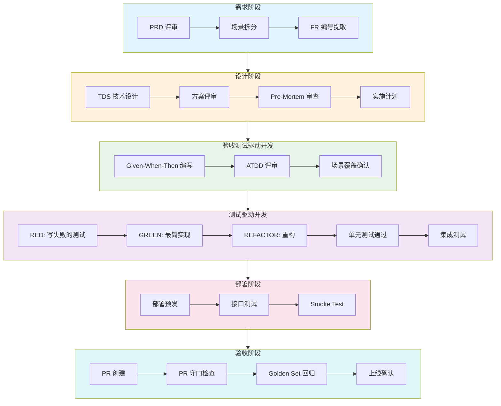
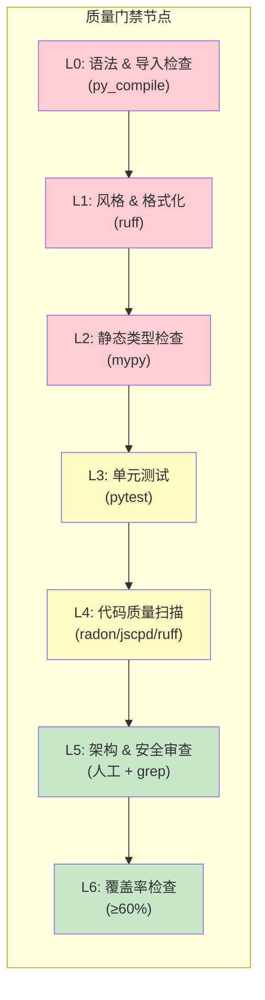

# Selfwell Harness 工程架构 V1.0

> **版本**: V1.0
> **日期**: 2026-07-17
> **状态**: DRAFT
> **真源**: 本文档是 Harness 体系的入口文档，引用 `.cursor/skills/ad-tdd/SKILL.md` 作为唯一工作流真源。

---

## 1. 概述

### 1.1 Harness 定义

**Harness**（测试驱动开发线束）是一套从需求到代码的完整工程链路，确保每个功能都经过：
- 需求可追溯
- 设计可验证
- 实现可测试
- 质量可量化

### 1.2 Selfwell 项目应用 Harness 的目的

| 目标 | 说明 |
|------|------|
| **质量保障** | 通过 L0-L6 质量门禁，确保代码符合 coding-standards 规范 |
| **可追溯性** | PRD → TDS → ATDD → TDD → 代码实现，全链路可追溯 |
| **效率提升** | 自动化工具链（ruff/mypy/pytest/Golden Set）减少人工审查成本 |
| **团队协作** | 统一文档体系与工作流，新成员可快速上手 |

---

## 2. 文档体系索引

```
docs/
├── requirements/          # 需求文档（外部输入）
├── architecture/         # 架构文档
│   ├── tech-architecture-design-v3.md   # 技术架构 V3（真源）
│   └── ...
├── spec/                 # 技术设计文档 (TDS)
│   ├── TDS-M*.md                     # 模块级技术设计
│   ├── SPEC-A0-MASTER-IA.md          # 页面架构总览
│   └── SPEC-HEADER-TEMPLATE.md        # TDS 模板头
├── harness/              # Harness 工程
│   ├── architecture.md               # 本文档
│   ├── atdd/                        # ATDD 验收标准
│   └── quality-gates.md             # 质量门禁详情
├── PRD/                 # 产品需求
│   └── Selfwell-PRD-V1.1.md         # 产品需求文档
├── scenarios/           # 用户场景
│   └── README.md                      # 场景总表
├── api/                 # 接口文档
└── data/                # 数据规范
    ├── ack-pool.yaml                  # ACK 话术池
    └── recall-forbidden-words.yaml    # Recall 敏感词库
```

### 2.1 文档类型对照表

| 文档类型 | 路径 | 用途 | 对应 Harness 阶段 |
|---------|------|------|-----------------|
| **PRD** | `docs/PRD/` | 产品需求层：产品要做什么 | 需求评审 |
| **Scenarios** | `docs/scenarios/` | 用户视角拆解：用户怎么用 | 需求确认 |
| **TDS** | `docs/spec/TDS-M*.md` | 技术设计文档：代码怎么实现 | 方案设计 + 实施计划 |
| **ATDD** | `harness/atdd/` | 验收标准：Given-When-Then 格式 | 验收标准确认 |
| **UT** | `backend/tests/unit/` | 单元测试 | 单测 |
| **IT** | `backend/tests/integration/` | 集成测试 | 接口测试 |

---

## 3. Quality Gates 流程图

### 3.1 整体流程图



### 3.2 质量门禁节点



---

## 4. AD → ATDD → TDD 工作流详解

### 4.1 工作流总览

```
PRD → Scenarios → Architecture(TDS) → ATDD → TDD(RED) → TDD(GREEN) → Refactor → UT → IT → Sign-off
```

### 4.2 阶段详解

| 阶段 | 输入 | 输出 | 工具 |
|------|------|------|------|
| **Architecture** | PRD + Scenarios | TDS 技术设计文档 | — |
| **ATDD** | TDS + 用户旅程 | Given-When-Then 验收标准 | Gherkin |
| **TDD RED** | ATDD Scenario | 失败的测试用例 | pytest |
| **TDD GREEN** | 失败的测试 | 最简实现 | pytest |
| **Refactor** | 通过的测试 | 重构代码 | ruff/radon |
| **UT** | 实现代码 | 单元测试通过 | pytest |
| **IT** | UT | 集成测试通过 | pytest |
| **Sign-off** | IT | PR 提交 | pr-gate |

### 4.3 阶段产出对照表

| 阶段 | 产出文件 | 存放位置 |
|------|---------|---------|
| Architecture | `TDS-M*.md` | `docs/spec/` |
| ATDD | `TDS-*-AC.md` | `harness/atdd/` |
| TDD | `test_*.py` | `backend/tests/unit/` |
| IT | `test_*_integration.py` | `backend/tests/integration/` |

---

## 5. 工具链说明

### 5.1 `.cursor/skills/` - 技能规范

| Skill | 用途 | 触发条件 |
|-------|------|---------|
| `ad-tdd/SKILL.md` | AD→ATDD→TDD 工作流 | 编写代码时触发 |
| `coding-standards.mdc` | Python 编码规范 | 编写 Python 代码时触发 |
| `golden-set/SKILL.md` | Golden Set 维护 | 修改 Prompt 时触发 |
| `pr-gate/SKILL.md` | PR 守门检查 | 创建 PR 时触发 |
| `frontend-standards/SKILL.md` | 前端编码规范 | 编写前端代码时触发 |

### 5.2 `.cursor/rules/` - 规则文档

| 规则 | 作用域 |
|------|--------|
| `project-prohibitions.mdc` | 5 条工程红线 |
| `file-operation-stability.mdc` | 文件操作工具优先级 |
| `project-meta.mdc` | 项目元信息 |
| `skills.mdc` | Skill 触发导航 |

### 5.3 `.cursor/hooks/` - 钩子脚本

| 钩子 | 功能 |
|------|------|
| `guard-shell.ps1` | 拦截违规 shell 命令（exit 2） |

---

## 6. 快速开始指南

### 6.1 新功能开发流程

1. **需求确认**
   - 阅读 `docs/PRD/Selfwell-PRD-V1.1.md`
   - 阅读对应 `docs/scenarios/S*.md`

2. **生成 TDS**
   ```bash
   # 根据需求生成技术设计文档
   # 输出: docs/spec/TDS-M*.md
   ```

3. **生成 ATDD**
   ```bash
   # 为每个 FR 生成 Given-When-Then 验收标准
   # 输出: harness/atdd/TDS-*-AC.md
   ```

4. **TDD 开发**
   ```bash
   cd backend
   
   # RED: 写测试
   uv run pytest tests/unit -x -q --tb=short
   
   # GREEN: 写实现
   # ... 实现代码 ...
   
   # REFACTOR: 重构
   uv run ruff check . --fix
   uv run ruff format .
   ```

5. **质量门禁**
   ```bash
   # L0-L3
   uv run ruff check . --fix && uv run ruff format --check .
   uv run mypy --strict app/
   uv run pytest tests/unit -x -q
   
   # L4-L6
   uv run ruff check . --select=F401,F811,S608,S307,SEC,B,B003
   uv run jscpd . --threshold 3
   uv run pytest --cov=app --cov-fail-under=60
   ```

6. **提交代码**
   ```bash
   # 满足全部条件后提交
   git add .
   git commit -m "feat(scope): subject"
   ```

### 6.2 检查清单

- [ ] TDS 技术设计文档已生成
- [ ] ATDD 验收标准已生成
- [ ] 所有 ATDD Scenario 已实现
- [ ] 全量回归测试 PASS
- [ ] 覆盖率达标 (≥60%)
- [ ] 通过 L0-L6 质量门禁
- [ ] commit message 符合 Conventional Commits

---

## 7. Quality Gates 检查清单

### 7.1 L0-L6 质量门禁

| 级别 | 检查项 | 工具 | 阈值 |
|------|--------|------|------|
| **L0** | 语法 & 导入 | `python -m py_compile` | 0 错误 |
| **L1** | 风格 & 格式化 | `ruff check/format` | 0 ERROR |
| **L2** | 静态类型 | `mypy --strict` | 0 错误 |
| **L3** | 单元测试 | `pytest tests/unit` | 0 失败 |
| **L4** | 代码质量 | `radon/jscpd/ruff` | 复杂度 ≤ A, 重复率 ≤ 4% |
| **L5** | 架构 & 安全 | 人工 + grep | 0 违规 |
| **L6** | 覆盖率 | `pytest --cov` | ≥ 60% |

### 7.2 PR 守门检查

| 检查项 | 说明 |
|--------|------|
| FR 关联性 | PR 描述包含关联的 FR 编号 |
| 验收测试 | 包含对应的 ATDD 测试用例 |
| ADR 冲突 | 不与现有 ADR 冲突 |
| 覆盖率门槛 | 新代码 ≥ 60% |
| CI 状态 | 所有 CI 检查通过 |

### 7.3 Golden Set 回归

| 场景 | 触发条件 | 阈值 |
|------|---------|------|
| Prompt 修改 | 改 `*.prompt` 或 `prompts/*.md` | baseline 跌幅 ≤ 5% |

```bash
# 运行 Golden Set 回归
python -m eval.runner --mode pr
```

### 7.4 14 条工程纪律检查

| # | 规则 | 检查命令 |
|---|------|---------|
| 1 | loguru import | `grep -rn "from loguru import logger" backend/app/` |
| 2 | print() | `grep -rn "print(" backend/app/` |
| 3 | 裸 except | `ruff check backend/app/ --select E722` |
| 4 | CancelledError | `ruff check backend/app/ --select ASYNC101` |
| 5 | AgentState TypedDict | `grep -rn ": dict" backend/app/agents/*/state.py` |
| 6 | f-string prompt | `grep -rn 'f".*{.*}.*".*system' backend/app/agents/` |
| 7 | LLM 参数硬编码 | `grep -rn 'model=".*"\|temperature=0.' backend/app/services/` |
| 8 | 依赖声明 | `uv pip check` |
| 9 | 错误码导入 | `grep -rn 'E_[A-Z_]\+ = "' backend/app/` |
| 10 | Pydantic docstring | `ruff check backend/app/ --select D102` |
| 11 | service docstring | `ruff check backend/app/services/ --select D102` |
| 12 | McCabe 复杂度 | `radon cc backend/app/ -a -s` |
| 13 | jscpd 重复率 | `jscpd backend/app/ --threshold 3` |
| 14 | 测试覆盖率 | `pytest --cov=backend/app --cov-fail-under=80` |

---

## 附录 A：相关文档索引

| 文档 | 路径 |
|------|------|
| AD→ATDD→TDD 工作流 | `.cursor/skills/ad-tdd/SKILL.md` |
| TDS 模板 | `docs/spec/SPEC-HEADER-TEMPLATE.md` |
| ATDD 示例 | `.cursor/skills/ad-tdd/SKILL.md` §2 |
| L0-L6 质量门禁 | `.cursor/skills/coding-standards/GATES.md` |
| PR 守门 | `.cursor/skills/pr-gate/SKILL.md` |
| Golden Set | `.cursor/skills/golden-set/SKILL.md` |
| 14 条工程纪律 | `.cursor/skills/coding-standards/GATES.md` §13 |

---

## 附录 B：版本历史

| 版本 | 日期 | 变更内容 |
|------|------|---------|
| V1.0 | 2026-07-17 | 初版 |
